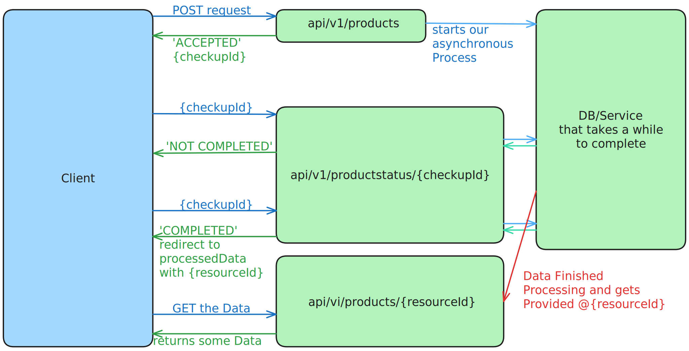

# Asynchronous API
Minimal Api. Revolves around the Client posting a large number or Data to our Service.

This should take so long, as that we want to decouple the `your post received` and the `your post has completely ran trough` messages.

So in that sense being Asynchronous in it's response.




## setup
```
dotnet add package Microsoft.EntitiyFrameworkCore.Design
dotnet add package Microsoft.EntitiyFrameworkCore.Sqlite
```

Rough steps
1. Create our Model
2. Create our DBContext and inject it into our app
3. create EF migration: `dotnet ef migrations add initialMigration`
4. apply the migrations: `dotnet ef database update`